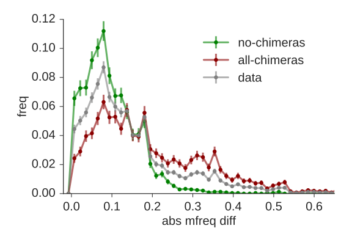

Calculates a metric (max-abs-diff) that helps to identify chimeric sequences.
In each sequence, we look for positions within V at which the SHM rate is dramatically different to the left vs to the right.
We find the position that maximizes this difference, and call that difference the maximum absolute difference, or max-abs-diff.
See intro-slides.pdf for details.

The script `find.py` calculates max-abs-diff for each input sequence.
The distribution of these values can be plotted and compared to the distributions in intro-slides.pdf.
In addition, the script prints the fraction of input sequences that have "very high" max-abs-diff (above a threshold specified by --cutoff).
These are sequences that are quite likely to be chimeric, and thus the larger the fraction that this represents of your repertoire, the more likely it is that you have an atypically large numbers of chimeric sequences.
A repertoire with zero chimeric sequences will typically have a fraction of around one percent.

Two example simulation samples are included in `examples/`, one with no chimeras, and one consisting entirely of chimeras.
The former has a value for the fraction described above of 0.012 (1.2%), while the latter has 0.21 (21%).
If you set `--plotdir`, `find.py` reads these two samples and plots them in the same figures with your data sample.
The extent to which your sample resembles one or the other gives you information about its chimera content.

`./find.py <your data csv file> --plotdir examples/plots`

Input csv file should have columns uid, v_naive, and v_mature (see the `examples/`)

